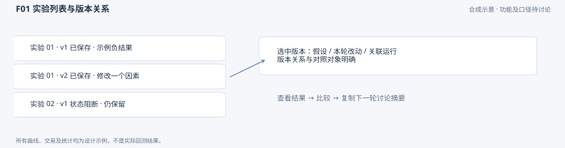
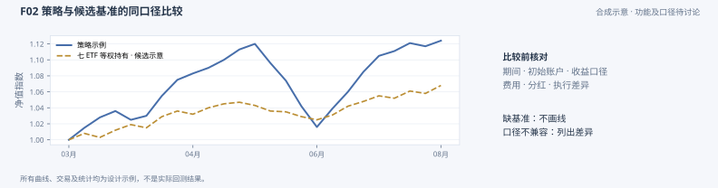
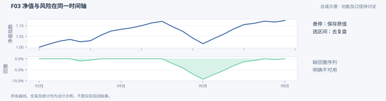
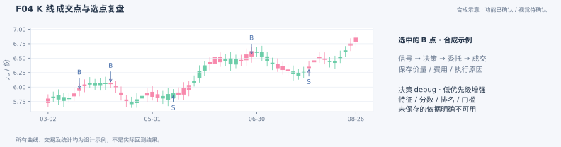
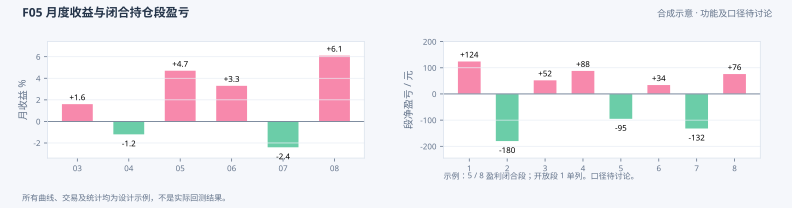
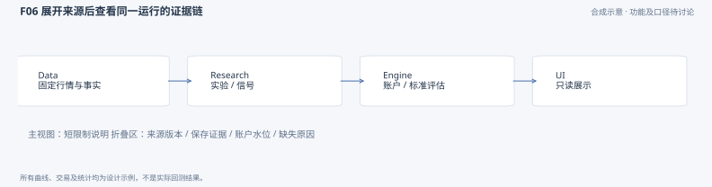

# Axiom 研究工作台 PRD 设计稿

2026-10-05 · **当前线上用户验收未通过 / 全项整改已授权 / 今晚重新验收。**三视图方向和功能讨论继续有效，但此前图例确认不等于实际页面通过。用户已要求集中修正本轮交互、阅读层次、交易链与统计展示；主协调先亲审完整设计，再亲审新 PR 和实际页面，当前线上保持。后续统一通过 [GitHub Pages](https://sinnergarden.github.io/axiom-ui/) 交付，不默认给本地路径。读取方式见 [应用页](../ui-workbench-read-contract.md)，整页交互及组件选择见 [UI §8](06_axiom_ui.md#8-本轮整页交互与视觉规范)。

全部图例仍为此前合成示意，不能作为实际回测、视觉验收或本轮全部交互证据；与本轮文字不同之处以本轮明确需求为准，尤其 F05 旧金额分布图不代表新百分比分布目标。旧深色、高密度规格仅作历史参考，P12 上下文与只读约束继续适用。

**已确认的工作原则：**讨论清楚 → 写入 axiom-docs → 其他 repo/task 引用 → 开发 → 对照验收。设计源、图源和口径统一保存；聊天用于讨论，HTML 和 ZIP 是生成交付。开发参照统一设计，若发现矛盾或缺 Owner 产物，先报主协调对齐，不自行绕过。本轮先集中设计，不按每条反馈零碎更新线上；不重复询问用户已确认功能。本文引用[现有 UI 设计](06_axiom_ui.md)的只读与上下文要求；模块分工只引用第 7 节的总纲边界表。

## 1 目标用户与研究问题

目标用户是与 dot 一起研究策略的个人研究者。用户提出 idea，dot 在另行授权的任务中实现并检查；工作台让用户看懂已保存结果，决定保留、否定或修改假设。首版围绕一个实验及其相关运行，避免先做完整研究平台。

用户需要回答：这轮检验什么、改了什么；相对基准和旧版是否改善；收益与风险集中在哪里；为什么在某日买卖或没有成交；证据是否来自同一批固定输入；下一轮只改什么。成功标准是用户能从结果指出证据和下一步，而非曲线达到收益目标。

## 2 从 idea 到下一轮的用户流程

| 步骤 | 用户操作 | 页面给出的结果 |
|---|---|---|
| idea | 与 dot 明确假设、对照和拟改因素 | Research 保存实验说明；UI 读取已有记录，不启动计算 |
| 实验列表 | 默认看近期结果，按研究问题→实验版本→运行浏览；按标签/状态、收藏或搁置筛选 | 看见成功、失败、阻断和负结果；不会只列赢家 |
| 单次回测 | 打开一个运行 | 上下文固定；先看收益风险与主要限制，再下钻细节 |
| 回测结果对比 | 在收益风险视图加旧版或市场基准 | 共用图和指标区展示保存结果；公共配置折叠，只提醒实际差异 |
| 变动与结果复盘 | 选变动项、异常日、月份、持仓段或成交点 | 并列查看变动清单与结果，定位证券、日期及交易链；UI 不生成因果结论 |
| 下一轮 | 复制本轮上下文、证据位置与拟改因素 | 得到可交给 dot 讨论的摘要；新实验仍由 Research 任务创建，UI 不重跑 |

所有视图保留同一实验、运行和版本上下文。返回总览不重置选择；显式换运行后图表和侧栏一起切换。F01 图展示实验与版本的关系。

## 3 六组功能提案

### F01 实验说明与版本

- **输入与展示：**Research 保存的研究问题、实验版本、运行、假设、参数、输入输出版本、变动清单与限制，及实验标签、收藏/搁置标记。按研究问题→实验版本→运行组织，默认近期结果。
- **操作与结果：**按标签或状态筛选、浏览收藏/搁置分组、选版本并打开运行；左 idea 栏可收起，运行显示自然名称/日期，hash 留在详情。复制上下文用于下一轮。收藏/搁置是 Research 的记录，UI 展示和筛选已有标记，不通过删除隐藏失败。
- **缺失与 owner：**未保存的说明显示“未提供”，不从参数编造假设。Research 提供记录和关联，UI 导航。**验收要求：**正、负、失败、阻断、收藏和搁置样例都可找到；切换后全部面板指向同一运行，原记录不变。

### F02 回测结果对比

- **输入与展示：**所选运行、旧版及 Engine 保存的市场基准和比较结果，Research 保存的版本变动清单。F02/F03 共用收益风险图与指标区：一个运行看表现，加旧版/基准即进入比较，不再画两套页面。
- **操作与结果：**选择对照、开关曲线、悬停预览/点击锁定日期，得到同日保存原值和真实变动清单。共用输入与执行条件先用自然摘要，只在差异处提醒；短详情和独立原始记录入口保留核验能力。公共设置不是 UI 重新回测的参数表，signal/策略/模型变化是研究改动，不凭 signal_ref 或 account_id 不同判定条件不兼容。
- **缺失与 owner：**未保存基准则标不可用；配置差异注明“非同口径”，不静默裁剪、换汇或重算。Engine 提供账户评估及基准，Research 提供变动与运行关联，UI 展示和联动。**验收要求：**加/删对照不换当前运行，不生成第二套收益风险面板；兼容样例等于保存值，差异提醒能定位具体字段。

### F03 收益与风险

- **输入与展示：**Engine 保存的净值/收益、回撤序列及标准指标；新增最大回撤峰谷日期/区间、Sharpe、Calmar 等由 Engine 固定口径并保存后读取。总览显示期间收益、最大回撤、费用、成交额与净值；风险区与收益区共用时间轴，接收 F02 所选对照。
- **操作与结果：**整个绘图区悬停吸附最近保存日，十字线联动，指针旁同时显示当日策略/基准/回撤；点击锁定并下钻。支持图内平移缩放、底部历史概览/拖动窗口、精确日期，3/6 个月快捷项为辅助。回撤卡显示峰谷日期及区间，点击定位并高亮。轴单位、多个刻度、自适应时间刻度与可选弱网格清晰。窗口仅定位保存点，指标仍归原报告范围。
- **缺失与 owner：**缺指标、序列或回撤日期分别显示不可用，不补零或推断峰谷；只有 nav_index 的旧报告仍称净值指数。短样本年化及风险指标的 null/不足原因按 Owner 保存状态展示。Engine 定义和计算，UI 格式化。**验收要求：**图中央远离细线也可悬停，预览不污染已锁定侧栏，拖动不误点；单位/同日缺值/原值正确，窗口同步且指标不变；严格零成交与日线近似身份明确，处理完成不代表策略有效。

F02 图展示添加对照的状态，F03 图展示同一视图的收益风险局部；两图不表示两个重复页面。

### F04 K 线与交易复盘

- **输入与展示：**绑定运行的 Data 行情/证券身份/事件和 Engine 保存的持仓、决策、委托、成交。默认调整后视觉 K 线，未复权可切换；Data 薄投影固定口径、锚点、cutoff 和成交显示映射，UI 不另实现复权。证券选择器、标题和详情统一中文名称+代码；原成交价、量、费用始终可查。
- **操作与结果：**年/月折叠定位→调仓批次摘要→单证券决策/意图/委托/成交链。搜索、日期/证券/状态筛选后分页或按需展开，K 线/B/S 点直达关联链。保存目标与买卖原因、订单量/拒单原因、成交量/价/费分列；未成交保留原因。图层和价格口径切换不换版本。特征/模型输入等更深 debug 为低优先级后续。
- **缺失与 owner：**缺 high/low 就提示 K 线不可用；缺合格复权投影则明确调整后视图未提供，仅允许明确标注的未复权降级。缺名称、trace、目标或数量逐项标未保存，不补事后理由。Data 事实、Core 保存依据及 Runtime 执行记录按第 7 节分工消费。**验收要求：**点值逐键对应原记录；按真实 ID/sequence 连链，不以同日造因果；决策完成、拒单、部分成交与实际成交可辨；事件/B/S 同显示坐标且原成交值不变；长历史不平铺到 DOM，筛选和锁定上下文一致。

### F05 月收益与持仓段统计

- **输入与展示：**保留用户认可的年份×月份账户月收益热力图；持仓段主分布使用 Engine 保存的净收益率百分比分布、平均收益和胜率。热力图以零为中性色，未提供/非完整月有独立标记；闭合/开放段及未纳入原因用中文解释，规则见第 4 节。
- **操作与结果：**点月份或持仓段，定位对应净值区间和交易链；用同一上下文查看收益是否集中于少数月份或少数持仓段。
- **缺失与 owner：**未保存百分比分布就显示未提供，不从 episodes 自行分桶或把金额桶改成%。账户统计由 Engine 提供；IC/ICIR 等信号评价由 Research 提供，按适用性展示，与账户统计分区。**验收要求：**月份/主分布单位为%，窄柱、细桶、零轴清晰，尾桶用有限阈值短句，不显示 inf；平均收益分母/权重可查；不足样本、平局、开放/左截断/收入范围可见，点击关联准确。

### F06 数据与运行信息

- **输入与展示：**owner 保存的依赖、数据版本、运行身份、质量说明和账户水位。主要限制用短句留在主视图；输入与执行条件用自然摘要，短详情只展示当前对象，不再默认堆两块长 JSON。
- **操作与结果：**展开某项、从图中点查、复制上下文摘要；按需打开独立原始记录入口查完整来源，运行状态、数据缺证和执行近似分别解释。不重复左导航的信息树。
- **缺失与 owner：**来源不可读时保留已知身份并报缺口；校验失败阻止当作有效结果展示，旧缓存注明截止点。各 owner 提供自身证据，UI 组合只读投影。**验收要求：**切换/刷新不混旧侧栏，现金与持仓水位一致；浏览前后 owner 产物不变，无采集、训练、重跑或下单调用。

## 4 已确认的基准与统计规则

**市场基准：**默认沪深300，独立于策略池；可选上证指数、纳斯达克100和旧策略版本对照。现有沪深300为 `000300.SH` 价格指数（不含分红），使用严格前一交易 session 锚点，披露与账户含分红收益的差异；其他参考的准确证券身份、来源和价格/全收益口径由 Owner 固定。跨市场明示原币、交易日历和评估范围；换汇与日历对齐由 Owner 保存，UI 不补算。缺保存参考标未提供，不取邻日值充当同日基准。精确合同引用 [Trade 日级 P10](04_axiom_trade.md#daily-evaluation)与[多年评价](04_axiom_trade.md#long-history-evaluation)。

**完整持仓段与胜率：**单证券持仓 0→非0→0 为一个完整段，段内加减仓合并，费用及分红计入净盈亏。胜率为净盈利段数÷可统计闭合段数，平局保留；开放段、初始持仓无入场记录的左截断段、已知收入未确定段单列且不进分母。Engine 按登记日权益归属持仓段，EX 确认收入一次，PAY 只转现金。可选分红观察证据仅证明固定源已观察记录；缺证时 pending 未知显示 null、已知 pending 数明示为 known，不把未知总量补成已排除的零。已观测闭合段的统计仍可保存，范围限制必须展示。UI 不把一次成交当完整交易。

**月收益和平均收益：**年份×月份热力图显示 Engine 保存的账户月收益率（%），保留现有清晰布局。冻结日历必须证明自然月边界及首末交易日覆盖；PARTIAL 正式收益为 null、observed_return 另列，不推测完整性。平均段净收益率和平均段净盈亏沿 Engine 保存口径展示，比例只格式化%，金额分只格式化元；缺结果不补零。完整统计定义以 [Trade P10](04_axiom_trade.md#daily-evaluation)为唯一工程来源。

比较时核对期间、初始账户、价格、费用、分红与执行假设；日常只提示差异，细节折叠。短样本不补年化。复盘展示保存链，不把相关性写成信号因果。其余工程一致性由我们负责，不增加重复的用户选择题。

**本轮分布修正：**主视图改为可统计闭合段的净收益率百分比分布，更多细桶、窄柱和明确零轴；开放段不混入，尾桶以有限阈值文字说明。Engine 在 Trade 主章冻结百分比桶边界、纳入范围、计数与不足样本合同，再独立保存新评价；UI 不决定桶或重算计数。现有 P10 金额八桶仍是旧保存报告的历史口径，不覆写、不改单位冒充新分布；逐段保存值可以查看，但不能称新分布已完成。本稿确认产品需求，不在 UI 再维护一套桶边界公式。

**本轮风险分析：**显示 Owner 保存的最大回撤峰/谷日期和区间，图中高亮并可一键定位；Sharpe、Calmar 等有用分析只在 Engine 冻结样本、日历/年化、风险基准与缺失语义后读取。主协调已通过新独立 evaluation v3 方向，准确 shape 待 Trade 主章冻结；滚动表现、换手/费用/集中度和段收益/持有期关系放次级展开区，首页仍聚焦基本表现与交易定位。值缺失或样本不足保留原因，不由 UI 推断日期、扫描序列或复制 Qlib 定义。技术合同仍由 Trade 主章维护。

## 5 首版、后续与非目标

**本轮范围：**保留三视图，集中完成 [UI §8](06_axiom_ui.md#8-本轮整页交互与视觉规范) 的阅读层次、整区十字线、点击锁定、轴与平移缩放、时间概览、回撤定位、证券名称、调整后 K 线及分层交易链、筛选/分页、持仓段中文说明、百分比分布、基准选择和 Owner 风险分析。月热力图保留。缺 Owner 产物不能伪称已完成。

**当前顺序：**①本轮集中设计与 Owner 缺口交主协调亲审；②Owner 在各自主章冻结所缺产物，UI 独立分支集中实施并开新 PR；③以已有固定小样本/已保存长 ETF 做针对性校验和真实浏览器检查，主协调亲看实际页面；④亲审通过再更新同一 Pages 地址，用户今晚重新验收。此前软件通过与线上可访问仅作基线，用户本轮未通过状态保持到实际再验收。已定功能不再重问，不默认提供本地文件路径。

**低优先级及后续：**深入特征/模型输入的决策 debug、多期/多模型图层、Qlib 适用信号诊断和阶段稳健性。已有目标/原因/订单/成交链与长历史筛选分页属于本轮，不推到后续。**非目标：**采集、训练、自动研究、后台回测计算、改账本、真实下单、付费托管及收益承诺。

## 6 当前已有与接口缺口

当前 [Pages](https://sinnergarden.github.io/axiom-ui/) 已有交互三视图，绑定保存的 ETF 短/长结果、股票有界日线近似与历史 strict 对照及研究过程摘要。代码/只读验证与发布成功，用户实际产品验收未通过；不能继续把当前交互页面描述为仅静态 CLI，也不能因已有部分功能宣称完整产品通过。

既有合同继续引用 [Research 问题/版本/稳定回测组](05_axiom_research.md#experiment-records)、[Engine P10](04_axiom_trade.md#daily-evaluation)、[多年评价](04_axiom_trade.md#long-history-evaluation)和 [Data](02_axiom_data.md)。已保存显示投影具有 OHLCV、账户原值与交易链部分证据，无需为 UI 再查 Data 或重跑账户。Research 提供说明/版本差异，Engine 公共 loader 仅读取/校验；适用信号评价与深 debug 不被 UI 补算。

本轮需要主协调对齐的读取缺口：Data 固定中文证券名称、调整后薄行情/同口径成交显示映射及锚点/cutoff；Engine 保存的收益百分比序列、最大回撤日期/区间、净收益率分布、额外基准和 Sharpe/Calmar 适用状态；运行方可公开展示的 Core 目标/原因与稳定交易链关联。当前股票保存件已有 targets/intents/trace、委托数量及 fill→order→intent ID，应优先保留已存在证据，不默认请求新算一遍。缺少的批次关联或 ETF 原因以 Owner 实际保存内容为准，UI 不造 ID/理由。字段准确形状在 Owner 主章冻结后消费，本稿只记录需求和缺口。

## 7 边界与未来部署约束

模块职责、输入、输出、消费者与不负责范围统一引用[总纲唯一模块边界表](https://github.com/sinnergarden/axiom-docs/blob/c22f49342b415290abc7d45d438e4d58013a1c45/docs/design/01_axiom_overview.md#module-boundaries)。本 PRD 的功能输入与验收说明仅应用该分工，不另维护一份边界规范，也不新增接口或计算职责。

UI 读取 Research 公共投影与 Engine 已保存且 Reader 支持的账户/评价版本，兼容既有保存件，不新建研究 registry、不写收藏或搁置、不重算统计。运行关联保留 Engine 原值 `run_id+content_digest+committed_sequence`，评价保留原 evaluation_ref/content_digest 并匹配 input_run_ref。新评价需求独立保存，不伪造旧结果字段或覆写历史保存件。

同一保存回测的评价或登记修订按 Research 的稳定 `saved_run_ref` 聚合，默认列表使用 `saved_backtest_count`，登记历史另列 `registration_count`；不把更新报告显示为新回测。收藏/搁置读取组的 `organization`，筛选使用 run_favorite/run_shelved；分组与 tags 保持问题级。组导航登记与全部 `registration_history` 分开显示，最新保存时间不等于评价审核状态。FAILED/BLOCKED 或仅信号登记的 REGISTRATION_ONLY 项可浏览，不能计入回测数。准确投影与只读边界统一引用 [Research 主章](05_axiom_research.md#experiment-records)。

**当前已授权且已交付：**免费静态 GitHub Pages，统一地址 https://sinnergarden.github.io/axiom-ui/ 。本轮新增源码/清理后的授权精选页面经新 PR 亲审后更新原地址，不另开托管平台或付费服务。后台计算/保存仍由各 Owner 在既有环境执行；UI 页面不会启动计算。后续远程只读 API/鉴权另定，密钥不进入前端。

公开范围只含用户明确授权的精选结果和必要显示事实；原完整 Owner 文件、训练输入、无关私人研究、机器路径与凭据不公开。本人私有交付按授权执行，不能以公开边界阻挡正常本人交付，也不将其自动扩成公开原始数据授权。

## 8 本次实施与验证边界

此前合成图源为独立图例，不构成同一可核验账户。本轮以现页用户未通过为基线，对所有反馈集中设计/实现/再验收；不把软件或原图确认代替真实体验。整页方案与 Owner 合同先交主协调亲审，UI 仅改独立分支，以已有保存投影为优先，新增 Owner 报告只读/hash/身份绑定验收，不因页面改动做全量 suite、账户重跑或 Data 重采。缺口逐项报告；不读取 current、训练或下单。Qlib 继续只作参考。

源稿与图源只在 axiom-docs 维护，UI repo 保留实现使用说明；旧 Library HTML/ZIP 和合成图为历史交付，不是今晚验收入口。实现 PR 给出需求逐项证据、固定组件/许可、原值与关联检查、真实桌面/手机浏览器体验及截屏。主协调亲审新 PR 和实际页面后再更新 Pages；最终用户再验收。公开构建仅使用明确授权精选投影，完整私人来源不进入公开仓库；交付校验也检查生成字节、来源身份及无泄露。本轮不顺带改教学 Notebook、Owner 根或 bulk 进程。

## 9 简短参考注：Qlib 候选

查阅 [Qlib 官方报告文档](https://qlib.readthedocs.io/en/latest/component/report.html)及源码固定版本 `be725493eb1a6bbb42bf11b37aa7669f59610ff1`（2026-10-04）。下表只借展示与指标选择，不引入 Qlib 回测或另一套核算。

| 候选 | 适用范围与 owner | 官方源码 |
|---|---|---|
| 策略/基准、成本、回撤与换手共用时间轴 | F02/F03 基本组合已确认；额外成本前后和换手图层由 Engine 提供保存序列后开启 | [report_graph](https://github.com/microsoft/qlib/blob/be725493eb1a6bbb42bf11b37aa7669f59610ff1/qlib/contrib/report/analysis_position/report.py#L25-L164) |
| 波动、超额风险指标与信息比率 | 已有同口径基准、足够样本及冻结年化协议时，由 Engine 评估；不在 65 日样本强补 CAGR/Sharpe | [risk_analysis](https://github.com/microsoft/qlib/blob/be725493eb1a6bbb42bf11b37aa7669f59610ff1/qlib/contrib/evaluate.py#L26-L94) |
| IC/Rank IC 时间序列、ICIR、月度 IC 与分布 | 有保存分数、成熟标签、可用截面与时间样本时，由 Research 评估；当前规则 ETF 不假称已有结果 | [model report](https://github.com/microsoft/qlib/blob/be725493eb1a6bbb42bf11b37aa7669f59610ff1/qlib/contrib/report/analysis_model/analysis_model_performance.py#L119-L221)、[SigAnaRecord](https://github.com/microsoft/qlib/blob/be725493eb1a6bbb42bf11b37aa7669f59610ff1/qlib/workflow/record_temp.py#L295-L354) |
| 分数组标签收益、头尾差、分数自相关与头尾名单变动 | 后续截面排序/ML 诊断，Research 保存分组、标签及样本规则；不当成扣费账户收益或完整持仓段盈亏 | [group/model performance](https://github.com/microsoft/qlib/blob/be725493eb1a6bbb42bf11b37aa7669f59610ff1/qlib/contrib/report/analysis_model/analysis_model_performance.py#L21-L79) |

口径差异：`report_graph` 用 `cumsum`，`risk_analysis` 支持 `sum/product` 且默认 `sum`；其默认收益累加与 Axiom NAV/CAGR 不能混用，年化因子也不直接复制。`SigAnaRecord` 的 ICIR 为均值/标准差，未年化；Axiom 按 Research 保存的定义命名。Qlib 的年份×月份热力图示例是 **Monthly IC**，账户月收益热力图是本轮已确认的 UI 需求，只借版式。完整持仓段和胜率按第 4 节由 Engine 提供，不以 Qlib 的日持仓/分组图替代。
